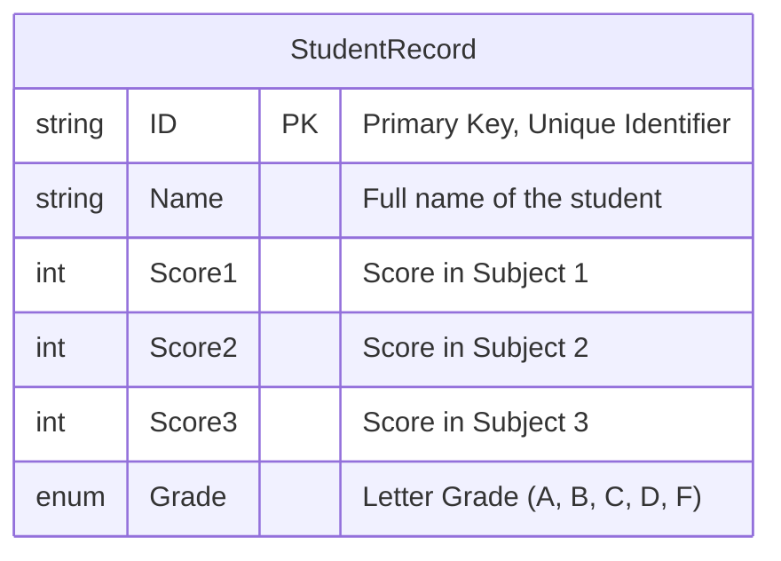

## Software Requirements Specification (SRS)

**Student Grade Management System**

### 1. Introduction

#### 1.1 Purpose

This document specifies the requirements for a **Student Grade Management System**, a console-based application designed to support programming students in practicing core programming concepts, including variables, control structures, functions, structs, and enums. The system manages student records and grades efficiently, reinforcing theoretical knowledge through practical implementation.

#### 1.2 Scope

The system will allow users to:

- Add and update student records.
- Calculate grades based on provided scores.
- Display summarized performance metrics (e.g., highest score, average score).  
  This application is intended for educational use, emphasizing the practical application of fundamental programming constructs.

#### 1.3 Definitions, Acronyms, and Abbreviations

- **Student Record**: Data structure containing fields like Student ID, Name, and Scores.
- **Grade**: A letter grade (e.g., A, B, C) assigned based on performance.
- **Pass/Fail**: Status determined by achieving a minimum grade threshold.

---

### 2. Overall Description

#### 2.1 Product Perspective

The system is a standalone console application implemented in C#. It does not include persistent storage (database or file system) and focuses solely on demonstrating programming fundamentals.

#### 2.2 Product Functions

Key functionalities include:

- **Add Student**: Record details such as ID, name, and scores.
- **Update Student**: Modify scores for an existing student.
- **Calculate Grades**: Assign grades based on score averages using enums.
- **Display Results**: Summarize performance data, such as average scores, highest scores, and pass/fail lists.

#### 2.3 User Classes and Characteristics

**Primary Users**: Students with basic knowledge of programming concepts, such as:

- Variables and data structures.
- Control structures (if-else, loops).
- Functions and enums.

#### 2.4 Operating Environment

- **Platforms**: Windows, Linux, or macOS.
- **Development Language**: C# using .NET Framework/Core.
- **IDE**: Visual Studio or any C#-compatible code editor.

#### 2.5 Design and Implementation Constraints

- Console-based application.
- No graphical interface or persistent storage (data stored in memory only).
- Adheres to simplicity for beginner-level programming exercises.

#### 2.6 Assumptions and Dependencies

- Users possess basic programming knowledge.
- Devices running the application have the .NET runtime installed.

---

### 3. System Features

#### 3.1 Add Student

**Description**: Enable users to add new student records, including ID, name, and scores.  
**Priority**: High

**Functional Requirements**:

- **FR1**: Allow input of ID, name, and scores for three subjects.
- **FR2**: Store the data in memory using structs.

---

#### 3.2 Update Student

**Description**: Facilitate updates to the scores of an existing student.  
**Priority**: Medium

**Functional Requirements**:

- **FR3**: Enable searching for a student using their ID.
- **FR4**: Allow score updates for the selected student.

---

#### 3.3 Calculate Grades

**Description**: Automate grade assignment based on average scores.  
**Priority**: High

**Functional Requirements**:

- **FR5**: Calculate the average score for each student.
- **FR6**: Assign grades based on the criteria:
  - **A**: Average ≥ 90
  - **B**: 80 ≤ Average < 90
  - **C**: 70 ≤ Average < 80
  - **D**: 60 ≤ Average < 70
  - **F**: Average < 60
- **FR7**: Use enums to represent grades (e.g., `Grade.A`).

---

#### 3.4 Display Results

**Description**: Provide summaries of student performance.  
**Priority**: Medium

**Functional Requirements**:

- **FR8**: Display all student records (ID, name, average score, grade).
- **FR9**: Highlight the student with the highest average score.
- **FR10**: Calculate and display the overall average score.
- **FR11**: List students who passed (grade ≥ D).
- **FR12**: List students who failed (grade = F).

---

## Detailed step-by-step guide:

---

### **Design Phase**

#### **1. Define Data Structures**

- **Student Record Struct**:

  - Design a struct named `StudentRecord` to store:
    - `ID` (string): A unique identifier for each student.
    - `Name` (string): The full name of the student.
    - `Scores` (array or list of integers): Scores for three subjects.
    - `Grade` (enum): The calculated grade (default as "Not Assigned").
  - Example:
    ```csharp
    public struct StudentRecord
    {
        public string ID;
        public string Name;
        public int[] Scores;
        public Grade Grade;
    }
    ```

- **Enum for Grades**:
  - Define an enum named `Grade` with values: A, B, C, D, F.
  - Example:
    ```csharp
    public enum Grade
    {
        A,
        B,
        C,
        D,
        F,
        NotAssigned
    }
    ```

---

#### **2. Plan System Flow**

- **Menu-Driven Interface**:
  - Design a console-based menu to provide the following options:
    - `1. Add Student`
    - `2. Update Student`
    - `3. Calculate Grades`
    - `4. Display Results`
    - `5. Exit`
  - Plan for a loop to continuously show the menu until the user exits.
  - Use a `switch` statement to handle user choices.
- **Logical Workflow**:
  - Determine how data will flow between functions:
    - User inputs data for operations (Add/Update).
    - Functions manipulate data stored in memory.
    - Outputs are displayed in the console for summaries.

---

### **Development Phase**

#### **1. Build Core Functionalities**

##### **a. Add Student**

- **Purpose**: Allow the user to add a new student record.
- **Steps**:

  1. Prompt the user to input `ID`, `Name`, and `Scores` for three subjects.
  2. Validate inputs (e.g., check for duplicate IDs).
  3. Create a new `StudentRecord` instance and populate fields.
  4. Store the new record in an in-memory collection (e.g., `List<StudentRecord>`).

  - Example Code:

    ```csharp
    public static void AddStudent(List<StudentRecord> students)
    {
        Console.Write("Enter ID: ");
        string id = Console.ReadLine();

        Console.Write("Enter Name: ");
        string name = Console.ReadLine();

        int[] scores = new int[3];
        for (int i = 0; i < 3; i++)
        {
            Console.Write($"Enter Score {i + 1}: ");
            scores[i] = int.Parse(Console.ReadLine());
        }

        students.Add(new StudentRecord { ID = id, Name = name, Scores = scores, Grade = Grade.NotAssigned });
        Console.WriteLine("Student added successfully!");
    }
    ```

---

##### **b. Update Student**

- **Purpose**: Modify scores for an existing student.
- **Steps**:

  1. Prompt the user to input the `ID` of the student to be updated.
  2. Search the list of students for the matching ID.
  3. If found, allow the user to enter new scores.
  4. Update the corresponding `StudentRecord` in memory.

  - Example Code:

    ```csharp
    public static void UpdateStudent(List<StudentRecord> students)
    {
        Console.Write("Enter Student ID to update: ");
        string id = Console.ReadLine();

        var student = students.FirstOrDefault(s => s.ID == id);
        if (student.Equals(default(StudentRecord)))
        {
            Console.WriteLine("Student not found!");
            return;
        }

        Console.WriteLine($"Updating scores for {student.Name}");
        for (int i = 0; i < 3; i++)
        {
            Console.Write($"Enter new Score {i + 1}: ");
            student.Scores[i] = int.Parse(Console.ReadLine());
        }

        Console.WriteLine("Student scores updated successfully!");
    }
    ```

---

##### **c. Calculate Grades**

- **Purpose**: Assign grades to students based on average scores.
- **Steps**:

  1. Iterate through the list of students.
  2. Calculate the average score for each student.
  3. Assign a grade using the criteria:
     - A: Average ≥ 90
     - B: 80 ≤ Average < 90
     - C: 70 ≤ Average < 80
     - D: 60 ≤ Average < 70
     - F: Average < 60
  4. Update the `Grade` field in each student’s record.

  - Example Code:

    ```csharp
    public static void CalculateGrades(List<StudentRecord> students)
    {
        foreach (var student in students)
        {
            double avg = student.Scores.Average();
            student.Grade = avg >= 90 ? Grade.A :
                            avg >= 80 ? Grade.B :
                            avg >= 70 ? Grade.C :
                            avg >= 60 ? Grade.D : Grade.F;

            Console.WriteLine($"{student.Name} assigned Grade: {student.Grade}");
        }
    }
    ```

---

##### **d. Display Results**

- **Purpose**: Show summaries like all records, highest score, and pass/fail lists.
- **Steps**:

  1. **Display All Records**:
     - Iterate and print each student’s details.
  2. **Highest Scoring Student**:
     - Find the record with the highest average score and display it.
  3. **Pass/Fail Lists**:
     - Separate students by grade (Pass: `D` or above, Fail: `F`).

  - Example Code:

    ```csharp
    public static void DisplayResults(List<StudentRecord> students)
    {
        Console.WriteLine("All Students:");
        foreach (var student in students)
        {
            Console.WriteLine($"ID: {student.ID}, Name: {student.Name}, Average: {student.Scores.Average()}, Grade: {student.Grade}");
        }

        var topStudent = students.OrderByDescending(s => s.Scores.Average()).First();
        Console.WriteLine($"Top Performer: {topStudent.Name}, Average: {topStudent.Scores.Average()}");

        var passed = students.Where(s => s.Grade != Grade.F);
        Console.WriteLine("Passed Students:");
        foreach (var student in passed)
        {
            Console.WriteLine(student.Name);
        }

        var failed = students.Where(s => s.Grade == Grade.F);
        Console.WriteLine("Failed Students:");
        foreach (var student in failed)
        {
            Console.WriteLine(student.Name);
        }
    }
    ```

---

#### **2. Implement Menu-Driven Interface**

- Create a loop to display the menu and prompt the user for their choice.
- Use a `switch` statement to call the appropriate function based on the input.
- Example Code:

  ```csharp
  static void Main()
  {
      List<StudentRecord> students = new List<StudentRecord>();
      while (true)
      {
          Console.WriteLine("\nMenu:");
          Console.WriteLine("1. Add Student");
          Console.WriteLine("2. Update Student");
          Console.WriteLine("3. Calculate Grades");
          Console.WriteLine("4. Display Results");
          Console.WriteLine("5. Exit");
          Console.Write("Choose an option: ");
          int choice = int.Parse(Console.ReadLine());

          switch (choice)
          {
              case 1: AddStudent(students); break;
              case 2: UpdateStudent(students); break;
              case 3: CalculateGrades(students); break;
              case 4: DisplayResults(students); break;
              case 5: return;
              default: Console.WriteLine("Invalid choice!"); break;
          }
      }
  }
  ```

---

### **ERD for the Student Grade Management System**

---

#### **Entities and Attributes**

1. **Table: StudentRecord**
   - **Primary Key (PK):** `ID` (Unique identifier for each student).
   - **Attributes**:
     - `Name` (string): Full name of the student.
     - `Score1` (integer): Score in the first subject.
     - `Score2` (integer): Score in the second subject.
     - `Score3` (integer): Score in the third subject.
     - `Grade` (enum): Letter grade (A, B, C, D, F).

---

### **ERD Diagram**

Here's the ERD visual representation:

- **Entity: StudentRecord**
  - PK: `ID`
  - Attributes: `Name`, `Score1`, `Score2`, `Score3`, `Grade`.

---

### **Mermaid Representation**



---
